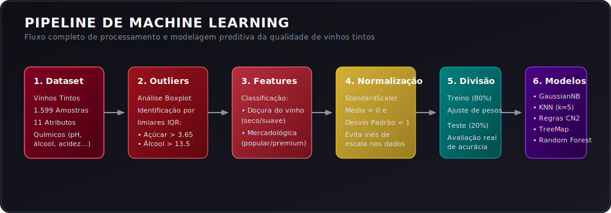
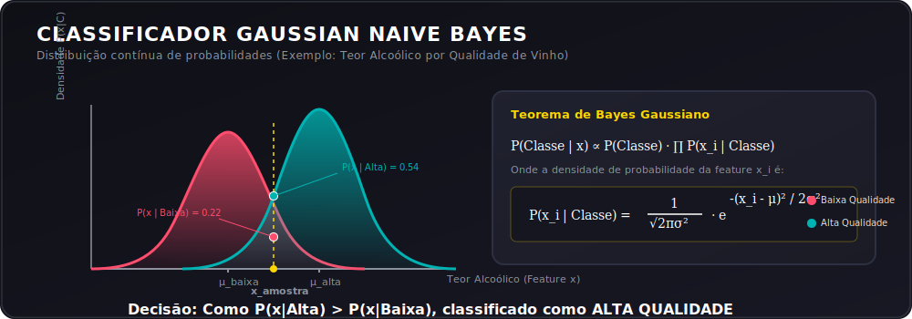
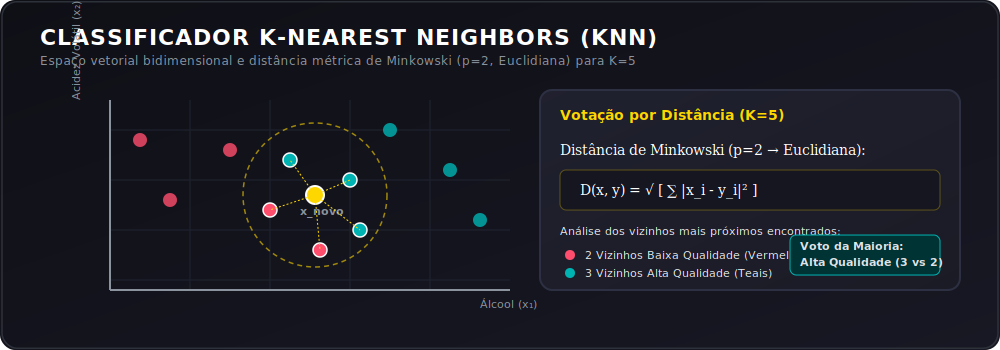
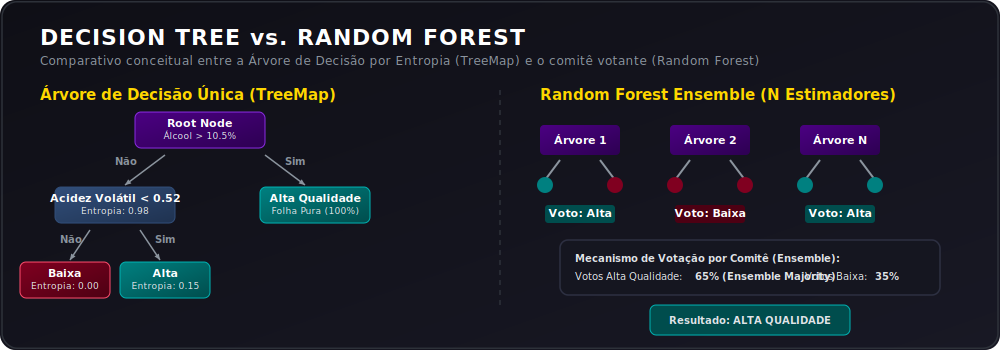

# 🍷 Aprendizagem de Máquina Aplicada à Classificação de Vinhos Tintos

<div align="center">
  
</div>

---

## 🎓 Contexto Acadêmico

Este repositório reúne os projetos práticos e avaliações desenvolvidos na disciplina de **Inteligência Artificial & Aprendizagem de Máquina** do curso de **Desenvolvimento de Software Multiplataforma (DSM)** na **FATEC Matão**. 

Os estudos práticos focam na aplicação de técnicas avançadas de análise exploratória, engenharia de recursos (*Feature Engineering*) e modelagem preditiva utilizando cinco dos principais classificadores da ciência de dados, tendo como base de estudo as propriedades físico-químicas de amostras de vinho tinto.

---

## ⚓ Menu de Navegação Rápida

Selecione um tópico para navegar diretamente pela documentação:

* [📊 1. O Conjunto de Dados & Propriedades Químicas](#-1-o-conjunto-de-dados--propriedades-químicas)
* [⚙️ 2. Análise de Outliers & Pré-processamento](#%EF%B8%8F-2-análise-de-outliers--pré-processamento)
* [🧪 3. Engenharia de Recursos (Feature Engineering)](#-3-engenharia-de-recursos-feature-engineering)
* [🧠 4. Modelagem Preditiva & Intuição Matemática](#-4-modelagem-preditiva--intuição-matemática)
  * [Gaussian Naive Bayes](#-gaussian-naive-bayes)
  * [K-Nearest Neighbors (KNN)](#-k-nearest-neighbors-knn)
  * [Indução de Regras CN2](#-indução-de-regras-cn2)
  * [Árvore de Decisão (TreeMap)](#-árvore-de-decisão-treemap)
  * [Random Forest Classifier](#-random-forest-classifier)
* [📈 5. Análise Comparativa de Resultados](#-5-análise-comparativa-de-resultados)
* [💻 6. Como Executar os Notebooks](#-6-como-executar-os-notebooks)
* [🤝 7. FATEC Matão & Autoria](#-7-fatec-matão--autoria)

---

## 📊 1. O Conjunto de Dados & Propriedades Químicas

O estudo é baseado em um dataset de **1.599 amostras** de vinhos tintos contendo 11 atributos físico-químicos contínuos e uma variável discreta de qualidade (`quality` com escala de 0 a 10):

| Atributo | Significado Químico | Impacto na Qualidade |
| :--- | :--- | :--- |
| **Fixed Acidity** | Ácidos fixos que não evaporam facilmente (ex: ácido tartárico). | Confere frescor e vivacidade ao paladar. |
| **Volatile Acidity** | Quantidade de ácido acético no vinho. | Em excesso, causa gosto azedo/vinagrado indesejado. |
| **Citric Acid** | Ácido cítrico em pequenas quantidades. | Adiciona frescor e notas frutadas. |
| **Residual Sugar** | Açúcar restante após o término da fermentação. | Determina se o vinho é classificado como seco ou doce. |
| **Chlorides** | Concentração de sais no vinho. | Influencia a percepção de salinidade e corpo do vinho. |
| **Free Sulfur Dioxide** | Dióxido de enxofre livre ($\text{SO}_2$). | Age como agente antimicrobiano e antioxidante preventivo. |
| **Total Sulfur Dioxide** | Dióxido de enxofre livre + ligado ($\text{SO}_2$). | Em altas concentrações compromete o sabor e aroma. |
| **Density** | Densidade do vinho em relação à água. | Varia de acordo com o teor de álcool e açúcar residual. |
| **pH** | Grau de acidez ou alcalinidade (escala 0-14). | Vinhos tintos ideais orbitam entre 3.3 e 3.6 de pH. |
| **Sulphates** | Aditivo que atua como conservante ativo. | Contribui para os níveis do gás protetor ($\text{SO}_2$). |
| **Alcohol** | Teor alcoólico volumétrico (% vol). | Essencial para o corpo, calor e estabilidade do vinho. |
| **Quality** | Nota sensorial média dada por especialistas (0 a 10). | Variável alvo original que reflete a avaliação humana. |

---

## ⚙️ 2. Análise de Outliers & Pré-processamento

A qualidade e robustez dos modelos de aprendizagem de máquina dependem diretamente do saneamento prévio da base. Duas etapas críticas foram conduzidas nos notebooks:

### A. Análise Estatística de Outliers (Boxplot)
Através do método do **Intervalo Interquartil (IQR)**, identificamos distribuições com caudas longas à direita para variáveis críticas:
* **Açúcar Residual (*Residual Sugar*):** Descobriu-se que o limite superior matemático de IQR (acima de $3.65\text{ g/L}$) capturava muitos registros como outliers. No entanto, por decisão estratégica de modelagem, estes pontos foram **mantidos**, pois representam vinhos genuinamente mais doces necessários para a classificação de doçura mercadológica.
* **Teor Alcoólico (*Alcohol*):** Valores acima de $13.5\%$ foram mapeados como outliers superiores mas retidos para preservar dados de vinhos encorpados de alta gama.

### B. Padronização de Recursos (*StandardScaler*)
Modelos baseados em distância (como KNN) são severamente prejudicados se as variáveis tiverem escalas muito diferentes. Por exemplo, o açúcar residual varia de $0.9$ a $15.5$, enquanto a densidade varia entre $0.990$ e $1.003$.

Aplicamos o `StandardScaler` do Scikit-Learn que reposiciona os dados para terem **Média $\mu = 0$** e **Desvio Padrão $\sigma = 1$** através da fórmula:

$$z = \frac{x - \mu}{\sigma}$$

Isso garante que nenhum atributo geométrico domine a função de custo do modelo de forma artificial.

---

## 🧪 3. Engenharia de Recursos (*Feature Engineering*)

Uma das contribuições mais sofisticadas dos projetos foi a criação de novos atributos categóricos de negócios baseados em regras químicas tradicionais e de mercado internacional:

### 1. Classificação de Doçura (`categoria_doçura`)
Mapeamento direto com base na concentração de açúcar residual conforme as diretrizes internacionais:
* **Sec (Seco):** Até $4.0\text{ g/L}$ de açúcar.
* **Demi-sec (Meio Seco):** De $4.0\text{ g/L}$ até $12.0\text{ g/L}$.
* **Mœlleux (Doce):** De $12.0\text{ g/L}$ até $45.0\text{ g/L}$.
* **Liquoreux (Muito Doce):** Acima de $45.0\text{ g/L}$.

### 2. Classificação Mercadológica de Vinhos (`categoria_classe`)
Mapeamento lógico e multidimensional que simula as complexas denominações de origem da Europa:
1. **`BOURGOGNE` (Premium):** Teor alcoólico $> 12\%$, densidade $< 0.99$ e qualidade $\ge 7$.
2. **`BORDEAUX` (Gourmet):** Teor alcoólico entre $10\%$ e $12\%$, densidade entre $0.99$ e $0.995$, e qualidade entre $6$ e $7$.
3. **`AOC` (Intermediário):** Teor alcoólico entre $9\%$ e $10\%$, densidade entre $0.995$ e $1.0$, e qualidade entre $5$ e $6$.
4. **`VDQS` (Básico):** Teor alcoólico entre $8\%$ e $9\%$, densidade $> 1.0$, e qualidade entre $4$ e $5$.
5. **`VIN DE TABLE` (Mesa):** Teor alcoólico $< 8\%$ ou qualidade $< 4$.
6. **`Outros Tipos`:** Vinhos que não atendem estritamente a nenhuma das regras anteriores.

---

## 🧠 4. Modelagem Preditiva & Intuição Matemática

O projeto colocou em competição cinco arquiteturas de aprendizado de máquina para prever a `categoria_classe` do vinho.

### 📐 Gaussian Naive Bayes

<div align="center">
  
</div>

O Naive Bayes é um classificador probabilístico baseado no **Teorema de Bayes**. Ele recebe a alcunha de "Naive" (Ingênuo) porque assume que todas as features preditoras são **100% independentes** entre si dado a classe.

Como os atributos físico-químicos são contínuos, assume-se que cada variável segue uma distribuição normal de Gauss. A probabilidade condicional de uma feature $x_i$ dada a classe $C$ é computada como:

$$P(x_i \mid C) = \frac{1}{\sqrt{2\pi\sigma^2_C}} e^{-\frac{(x_i - \mu_C)^2}{2\sigma^2_C}}$$

Onde $\mu_C$ e $\sigma^2_C$ são a média e variância da feature calculadas para os exemplos da classe $C$.
* **Vantagens:** Extremamente veloz, performa muito bem com poucos dados de treino.
* **Limitações:** A assunção de independência total raramente ocorre na natureza (ex: pH e acidez são correlacionados).

---

### 📐 K-Nearest Neighbors (KNN)

<div align="center">
  
</div>

O KNN é um algoritmo de aprendizado não-paramétrico e baseado em instância (*lazy learner*). Ele não gera uma fórmula matemática explícita de treinamento. Em vez disso, classifica um novo vinho buscando no espaço multidimensional os **$k$ vizinhos mais próximos** que já estão rotulados.

Nos projetos, adotamos **$k=5$** e a distância métrica de **Minkowski** com parâmetro $p=2$, que equivale exatamente à **Distância Euclidiana** clássica:

$$D(\mathbf{u}, \mathbf{v}) = \sqrt{\sum_{i=1}^{n} (u_i - v_i)^2}$$

O modelo atribui ao novo dado a classe que obtém a **maioria simples dos votos** entre esses $k$ vizinhos.
* **Vantagens:** Intuitivo, adapta-se facilmente a fronteiras de decisão complexas e não lineares.
* **Limitações:** Custo computacional de teste elevado (precisa calcular distâncias para todos os pontos da base), sensível a features irrelevantes.

---

### 📐 Indução de Regras CN2

O CN2 é um algoritmo clássico de **indução de regras de decisão** projetado para criar um conjunto ordenado de regras do tipo `IF-THEN` a partir dos dados de treinamento. Ele combina a eficiência da indução de árvores de decisão com a flexibilidade da indução de regras individuais.

* **Como funciona:** O algoritmo busca sequencialmente no dataset por regras que cobrem subconjuntos homogêneos de dados com alta entropia acumulada e pureza estatística. Uma vez que uma regra é criada, todos os registros cobertos por ela são removidos da base de treinamento e o algoritmo continua gerando regras para o restante até cobrir todo o espaço de dados.
* **Orange3:** A implementação foi efetuada utilizando a biblioteca de Data Mining **Orange3** (`Orange.classification.CN2Learner`), uma ferramenta altamente valorizada no ambiente de DSM.

---

### 📐 Árvore de Decisão (TreeMap)

<div align="center">
  
</div>

A Árvore de Decisão divide recursivamente os dados em subconjuntos baseando-se no atributo que fornece a maior pureza ou homogeneidade nos nós resultantes. O critério de divisão utilizado nos testes foi a **Entropia** (Ganho de Informação):

$$H(S) = -\sum_{i=1}^{c} p_i \log_2(p_i)$$

Onde $p_i$ é a proporção de amostras da classe $i$ no nó. A árvore busca partições que minimizem ao máximo a entropia média dos nós filhos.
* **Vantagens:** Extremamente explicável, transparente (pode ser visualizada de forma gráfica com facilidade) e ideal para capturar regras lógicas rígidas.
* **Limitações:** Alta propensão ao sobreajuste (*overfitting*) se não for devidamente podada.

---

### 📐 Random Forest Classifier

O Random Forest é um algoritmo de **aprendizado por comitê (*Ensemble Learning*)** baseado na técnica de *Bagging*. Ele cria dezenas de Árvores de Decisão individuais no momento do treino (foram utilizadas **40 árvores** no notebook).

Duas técnicas de aleatoriedade garantem a diversidade das árvores:
1. **Bootstrapping:** Cada árvore é treinada em uma subamostra aleatória com reposição do dataset.
2. **Subespaço Aleatório:** Em cada nó de decisão, apenas um subconjunto aleatório de atributos é considerado para a divisão.

A classificação final do vinho é decidida através de uma votação de maioria absoluta das previsões de todas as 40 árvores.
* **Vantagens:** Altíssima acurácia, robusto contra ruídos e reduz drasticamente o risco de *overfitting* inerente a uma árvore de decisão única.
* **Limitações:** Modelo "caixa-preta", mais lento para treinar e consome mais memória.

---

## 📈 5. Análise Comparativa de Resultados

Os resultados obtidos de acurácia em cada um dos testes práticos trazem revelações valiosas sobre a natureza das nossas features artificiais:

| Modelo de Classificação | Acurácia Obtida (%) | F1-Score Médio | Observação Estrutural |
| :--- | :---: | :---: | :--- |
| **Árvore de Decisão (TreeMap)** | **99.68%** | **1.00** | Desempenho quase perfeito devido à capacidade de desvendar a lógica hierárquica e condicional da variável `categoria_classe`. |
| **Random Forest** | **98.43%** | **0.98** | Excelente performance que confirma a eficácia do comitê em regras de classificação baseadas em limites rígidos de atributos. |
| **Indução de Regras CN2** | **98.24%** | **0.98** | Modelo puramente focado em induzir condicionais lógicas. Provou-se perfeito para replicar a lógica do dataset. |
| **Gaussian Naive Bayes** | **85.00%** | **0.86** | Bom desempenho, mas apresenta ruídos causados pela assunção ingênua de independência das variáveis e a descontinuidade do target. |
| **K-Nearest Neighbors (KNN)** | **83.12%** | **0.83** | Desempenho inferior. Em espaços vetoriais, limites lógicos de "degrau" criados por condicionais estritas prejudicam classificadores de distância. |

### 💡 Insight Científico sobre os Resultados
A variável dependente alvo foi programada como uma função condicional direta baseada nas propriedades químicas (`alcohol`, `density`, `quality`). 

Como consequência direta, **modelos baseados em regras lógicas estruturadas (Árvores de Decisão, Random Forest e CN2)** conseguiram "decodificar" as regras exatas de fatiamento dos dados e obtiveram desempenhos próximos de $100\%$. Em contraste, modelos baseados em probabilidades contínuas suavizadas (**Naive Bayes**) ou métricas de distância geométrica espacial (**KNN**) sofreram para modelar os cortes abruptos dos degraus condicionais de mercado.

---

## 💻 6. Como Executar os Notebooks

Os scripts e cadernos Jupyter foram desenvolvidos para fácil portabilidade no ambiente virtual **Google Colab** ou em seu interpretador local.

### Pré-requisitos & Instalação
Crie um ambiente virtual python e instale as dependências requeridas utilizando o terminal:

```bash
# Instalação das bibliotecas científicas padrão
pip install pandas numpy seaborn matplotlib plotly scikit-learn yellowbrick

# Instalação obrigatória das ferramentas do Orange Data Mining (usado para CN2)
pip install orange3 PyQt5
```

### Ordem Sugerida de Estudos
1. Comece abrindo o [Vinho_Tinto_GaussianNB.ipynb](file:///c:/Users/fraja/Downloads/readme/AprendizagemDeMaquina/Vinho_Tinto_GaussianNB.ipynb) para entender a análise exploratória, geração de boxplots, criação de features de doçura e treinamento base com Naive Bayes.
2. Em seguida, avance para o [Prova2_Hugo_Vinhos_Tintos.ipynb](file:///c:/Users/fraja/Downloads/readme/AprendizagemDeMaquina/Prova2_Hugo_Vinhos_Tintos.ipynb) onde o escopo é expandido para avaliar e competir os 5 modelos com representações gráficas comparativas ao final.

---

## 🤝 7. FATEC Matão & Autoria

* **Instituição:** Faculdade de Tecnologia de Matão (FATEC Matão)
* **Curso:** Tecnologia em Desenvolvimento de Software Multiplataforma (DSM)
* **Autor:** Hugo
* **Propósito:** Portfólio de Aplicações Práticas de Inteligência Artificial e Modelagem Preditiva.

---
<div align="center">
  <sub>FATEC Matão • Curso de Desenvolvimento de Software Multiplataforma • 2026</sub>
</div>